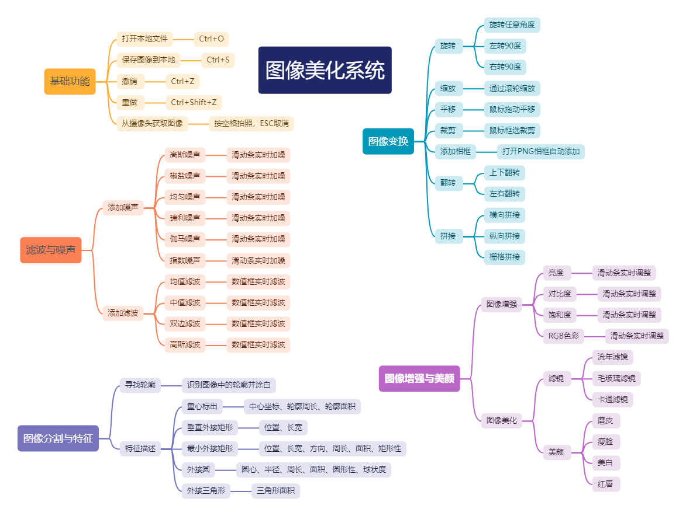

# 数字图像处理综合实验

这是大二下学期学习《数字图像处理》时的期末课程设计实验，主要使用 python 语言的 opencv 和 pyqt 库实现了一个简单的图像美化系统。

系统主要包括基础操作、噪声与滤波、图像变换、图像增强、图像美化、图像分割与特征描述等功能

---

## 功能介绍

## 调试说明

这是课设完成时时使用的开发环境，仅供参考:

* Windows 10
* PyCharm 2022.1.2 (Community Edition)
* Python 3.7
* PyQt5 5.15.6
* opencv-python 4.5.2.54
* dlib 19.17.99

本项目的一些功能使用了 dlib 库和 shape_predictor_68_face_landmarks.dat 

* 请下载对应版本的 dlib 库 whl 安装文件后在控制台通过 pip 安装；
* 下载 shape_predictor_68_face_landmarks.dat 后在代码中按照正确方式引用。